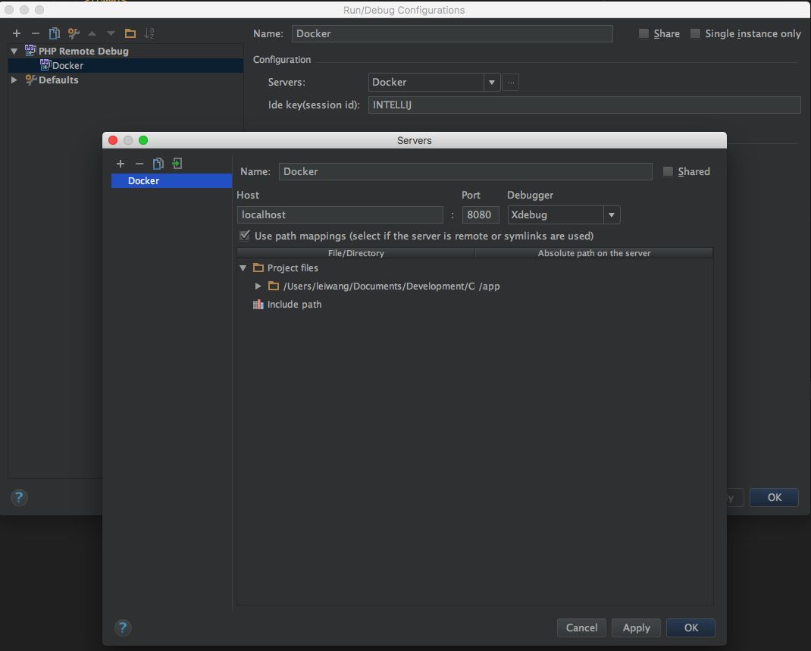
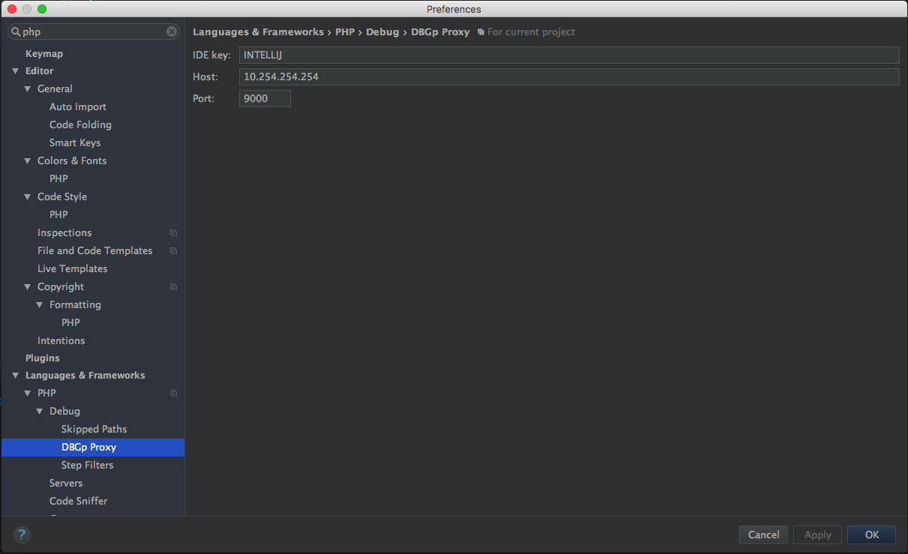

# docker-apache-php-symfony

## Build
```bash
docker build --force-rm -t bonnlei/docker-php .
```

## Usage
```bash
docker run --name apache-php -it --link=dev-mysql:mysql -v $(pwd):/app -p 8080:80 bonnlei/docker-php
```


## Debug your PHP in Docker with Intellij/PHPStorm and Xdebug

* Docker (Mac) De-facto Standard Host Address Alias
```
ifconfig lo0 alias 10.254.254.254
```
OR (permanent)
```
sudo curl -o /Library/LaunchDaemons/com.ralphschindler.docker_10254_alias.plist https://gist.githubusercontent.com/ralphschindler/535dc5916ccbd06f53c1b0ee5a868c93/raw/com.ralphschindler.docker_10254_alias.plist
```

* Config /etc/hosts
```
10.254.254.254     localhost
```

* Config xdebug.ini
```
xdebug.remote_host = 10.254.254.254
xdebug.remote_connect_back = 0
```

* Config Intellij

Remote debug config: 



Debug config: 



* References
  https://gist.github.com/chadrien/c90927ec2d160ffea9c4
  https://gist.github.com/ralphschindler/535dc5916ccbd06f53c1b0ee5a868c93